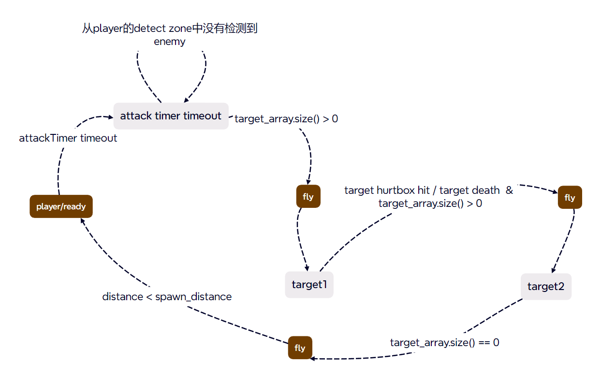

# Vampire Survivors tutorial follow

> 吸血鬼幸存者，[游戏教程](https://www.bilibili.com/video/BV1ok4y1c7yA)，自己加了点私货

## Godot Version
4.3


## lesson 0
[assets](https://github.com/brannotaylor/SurvivorsClone_Base)

## lesson 1
> 背景与player的移动

background  
- sprite2D设置资源文件
- region设置大小
- texture-filter设置过滤样式
- texture-repeat设置重复

player动画
- AnimateSprite2D设置角色动画，自动播放，循环播放

- texture-fitler-nearest，不继承全局，使清晰  

移动逻辑
- motion mode 设置floating
- _input检测输入设置属性
- _physics_process对velocity修改 
- move_and_slide()运动
- normlize()向量归一化
- delta帧时间对齐运动

## lesson 2
> 相机跟随，enemy定义

player相机  
- player添加camera2D节点  
- player设置分组
- 添加collisionShape  

enemy
- 添加collisionShape
- 在onready通过分组获取player节点 
- 运动跟随，global_position是相对与根节点树的全局位置


## lesson 3
> player朝向动画

player idle动画改为一帧，新加walk动画，两帧 
- 判断mov length，设置idle/walk
- 判断x_mov,设置flip_h设置动画反转

enemy类似

## lesson 4
> hitbox hurtbox

hitbox，攻击判定  
- collisionShape，hitbox进入hurtbox
- timer，（冷却用来重置）

hurtbox，受伤判定  
- collisionShape，hurtbox被hitbox进入
- timer
- cooldown（冷却），被连续攻击时，通过timer来禁用collisionShape，场景：处于火焰中。关于area_entered，只会触发一次，因为通过cooldown的timer来回禁用collisionShape，变成可以重复触发
- hitOnce（只会被攻击一次），场景：冰锥穿过多个敌人
- hitDisable（hitbox只会攻击一次），禁用hitbox的collisionShape，场景：冰球击中敌人后破碎  

layer&mask：layer是当前物体所处层，mask是要对指定层进行扫描。假设player层要对enemy层进行被进入判断，只需要将player的mask的添加enemy层，enemy的layer指定为enemy，无需再进行额外操作

## lesson 5
> 敌人的自动生成

SpawnInfo(Resource)，脚本形式的资源文件，是数据的集合  

  

EnemySpawner
- timer，内置计数器，计数器触发敌人生成
- 每次计数器触发，遍历spawner_info_array。如果time处于spawn_info的time_start与time_end时间段内，每隔spawn_enemy_delay就随机位置生成enemy_num个数的enemy_scene类型的敌人

## lesson 6
> 武器

icespear  

- 武器拥有各自的属性 
- level用来初始化其他属性，在ready中初始化
- target，在player对武器实例指定
- direction，player指向target的单位向量，用于运动

ps: rotaion是该节点的transform属性，单位弧度

使用VisibleOnScreenNotifier2D节点对武器离屏销毁  

DectectZone对进入该范围的Enemy进行捕获，注意其mask要添加enemy，而且是body_enter（捕获到enemy节点）,而不是area_enter（捕获到enemy节点下的area节点）.

武器的循环发射
- 使用timer来构造循环
- attackTimer，攻击delay
- reloadTimer，弹药补充delay

在hurtBox中对进入的area进行对武器hp的削减
武器节点添加分组hit

## lesson 6.1
> AudioBus,音频总线，全局单例  

冰矛在创建添加到树（触发ready），播放音频，如果这是过快被销毁，使用queue_free销毁整个冰矛，会一同销毁掉冰矛下的音频节点，所以创建音频总线管理
[音频总线参考](https://kidscancode.org/godot_recipes/4.x/audio/audio_manager/index.html)

## lesson 6.2
> 新的冰矛动画，[new icespear assets](https://pimen.itch.io/ice-spell-effect-01)


- 删除原来sprite2d，新增animateSprite2d。自动播放，循环播放
- 新增curshSprite2d是Sprite2d。通过animationPlayer关键帧控制动画
- 动画结尾关键帧处理销毁

## lesson 7
> 击退效果，HitOnce，敌人被击中音效，敌人死亡爆炸场景

击退
- 武器属性direction提供击退方向，knockback_force提供击退力
- 在enemy的hurtbox中area_enter捕获武器时获取direction，knockback_force
- hurtbox的hurt信号额外添加这两个参数，以提供给enemy
- enemy通过direction & knockback_force计算knockback
- enemy运动，`knockback = knockback.move_toward(Vector2.ZERO, knockback_recory)`使其不断减小，并累加到velocity上。表现为敌人收到来自direction方向的攻击，位置以knockback增量向direction改变，knockback逐渐变小，enemy逐步恢复原来的运动（走向player）

hitonce
- 武器新增信号remove(area)，area为自身self，在自身hp为0 或 被销毁时触发信号
- hurtbox中伤害类型hitonce逻辑补全，新增hit_once_array，用来记录当前enemy被首次击中时的武器。新增remove_from_hit_once_array(area)来对被销毁的武器进行删除。通过判断武器信号remove的is_connect是否连接到remove_from_hit_once_array，并通过connect进行连接。这样，当武器销毁时（hp为0，超出视口）自动删除hurtbox中的hit_once_array中的自己

击中音效
- enemy新增Audio节点，用来播放被击中时的音效

死亡爆炸
- 新增场景Expolision，敌人死亡时，通过get_parent()向父节点添加爆炸节点，并通过自身位置确定爆炸位置。这是因为敌人死亡，触发queue_free，如果爆炸添加到自身节点，会直接被删除，感官上什么也没有发生
- 爆炸场景包括AnimateSprite2D，播放爆炸动画，通过信号animation_finished自我销毁

## lesson 8
> 龙卷风，之字运动

- 主要属性和生成与冰矛类似，不同点在于运动轨迹

之字运动
- 与教程不同，使用向量和angle去处理（自己写的，已经准备申请专利了）
- 记录player的lastmove，用来指定龙卷风方向（direction）
- direction向量使用angle()获取向量角度
- 设定随机角度范围，定义运动角度，使用tween来线性变化运动角度
- 在physics_process中将运动角度转为向量（Vector2.from_angle()）
- 有运动方向后，就是完成之字运动了

PS:  

其他场景获取节点
- `@onready var player = get_node('/root/World/Player') as Player`依赖路径，但是方便
- `@onready var player = get_tree().get_first_node_in_group('player') as Player`利用分组，无视路径，但是需要额外设置分组
- `%`限制同场景
- 全局单例
- `Node.find_child()`全局搜索，可以无视路径，可以查找嵌套节点，废性能

关于绘制层与position
- 在player节点下生成weapon，更改weapon位置，weapon会相当于player运动，而不是world。启用Visiblity-Top Level，会在不是top level的层上绘制。用来脱离player。但是这样直接修改position（相对于父节点）会丢失父节点。所以在weapon生成时，需要指定position。但是教程中没有看到重新设置，有待考证

之字运动详解

```
var direction = Vector2.RIGHT
var direction_angle = 0
var angle_half_range_min = 10
var angle_half_range_max = 45
```
direction 即为player的lastmove
direction_angle 方向向量的角度
angle_range tween随机变化角度范围

```
func get_random_angle(is_less: bool) -> float:
	var angle_inc = deg_to_rad(randf_range(angle_half_range_min, angle_half_range_max))
	return (direction_angle - angle_inc) if is_less else (direction_angle + angle_inc)

```
获取随机角度

```
func random_tween():
	var type = randi_range(0, 1) == 0
	var tween = create_tween()
	var duration = 1.2
	tween.tween_property(self, 'direction_angle', get_random_angle(type), duration)
	tween.tween_property(self, 'direction_angle', get_random_angle(!type), duration)
	tween.tween_property(self, 'direction_angle', get_random_angle(type), duration)
	tween.tween_property(self, 'direction_angle', get_random_angle(!type), duration)
	tween.tween_property(self, 'direction_angle', get_random_angle(type), duration)
	tween.tween_property(self, 'direction_angle', get_random_angle(!type), duration)

```
在ready中调用，tween在不停变化方向角度

```
func _physics_process(delta: float) -> void:
	var direction_mov = Vector2.from_angle(direction_angle)
	position += direction_mov * speed * delta
```
在物理运动中根据方向角度去修改位置

## lesson 9
> 标枪  

状态：ready，fly

ready
- 表现：标枪指向player，并围绕其旋转
- 何时进入：生成时，默认状态。全部目标攻击完毕后(target_array为空)，fly回player时，如果距离player距离<=500，进入ready状态

fly
- 表现：单次攻击，标枪飞向enemy(target_array获取)
- 何时进入：attackTimer timeout时(并侦测到敌人时)；飞向敌人与目标敌人发生碰撞（指定下个target，飞行过程中与其他敌人碰撞不会触发进入）；飞向敌人时，目标敌人死亡。

整体流程：

- _ready，匹配等级参数配置属性，进入ready状态
- attackTime timeout，检查侦测到的敌人数量，如果大于0，根据侦测到的敌人数量更新target_array（全局target_num_max单次完整攻击流程可以被攻击到的目标），进入fly状态。如果timeout时没有检测到敌人，重启attackTime（使用timer来模仿循环）
- 进入到ready/fly状态，会设置sprite_2d-texture和collision_shape_2d-disabled。在单小次进入fly时，判断target_array-size来判断当前target应该是target_array[0]/player
- physice_process，运动控制，根据目前所处的状态，调用对应的state_update。
- state_ready_update，标枪围绕player旋转，player.position.direction_to(position)获取当前标枪指向player的角度，*spawn_distance控制距离。角度+angle_inc（在进入ready时归0，ready_update时累加）控制旋转
- state_fly_update，如果攻击目标全部攻击完毕（target_array-size==0）并且距离player小于spawn_distance，进入ready状态。使用插值来控制自身到目标的运动`position = position.lerp(target.position, delta * lerp_speed)`（或者position->target获取direction，position += direction * speed * delta）

## lesson 10
> 经验条，经验宝石  

宝石场景
- ready中根据exprience值设置不同texture
- physics_process向target运动
- 被收集时，隐藏sprite，禁用collision，play audio，返回经验值。经验值由enemy死亡，初始化宝石时设置
- audio play结束，清除

player
- 添加吸取范围，吸引该范围下的宝石，设置宝石target
- 添加抓取范围，触发宝石收集方法
- exp_collected获得的经验
- exp_level本级升级所需经验
```
func level_up():
	if exp_collected < exp_level:
		progress_bar_exp.value = exp_collected / exp_level * 100.
	else:
		var exp_over = exp_collected - exp_level
		exp_collected -= exp_level
		level += 1
		exp_level = level * 50
		progress_bar_exp.value = 100.
		level_up()
```
- 获取经验少于本级升级所需经验，更新ui
- 大于等于，经验减去升级所需经验，升级，更新本级所需经验，更新ui，递归（连续升级）

enemy
- 死亡根据位置&经验属性生成宝石，指定位置与经验值