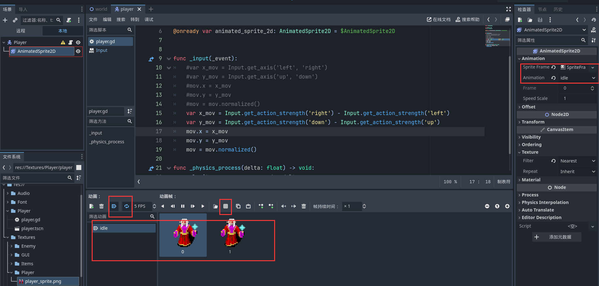
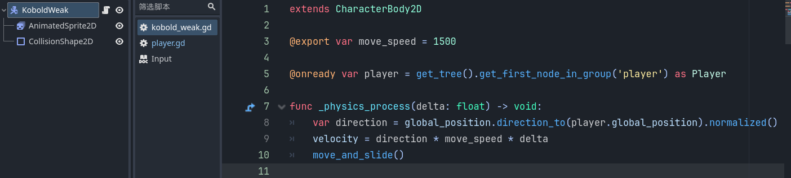
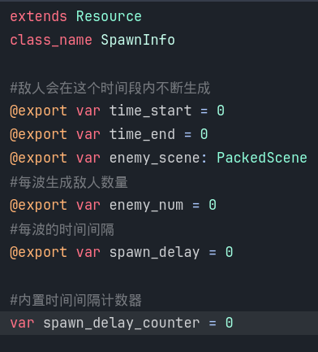
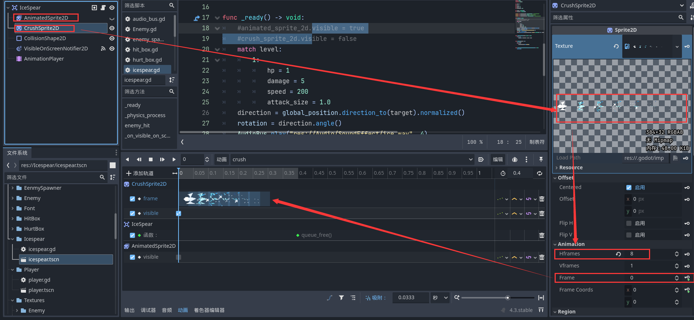

# Vampire Survivors tutorial follow

> 吸血鬼幸存者，[游戏教程](https://www.bilibili.com/video/BV1ok4y1c7yA)，自己加了点私货

## Godot Version
4.3

## lesson 0
[assets](https://github.com/brannotaylor/SurvivorsClone_Base)

## lesson 1
> 背景与player的移动

background  
- sprite2D设置资源文件
- region设置大小
- texture-filter设置过滤样式
- texture-repeat设置重复

player动画
- AnimateSprite2D设置角色动画，自动播放，循环播放

- texture-fitler-nearest，不继承全局，使清晰  

移动逻辑
- motion mode 设置floating
- _input检测输入设置属性
- _physics_process对velocity修改 
- move_and_slide()运动
- normlize()向量归一化
- delta帧时间对齐运动

## lesson 2
> 相机跟随，enemy定义

player相机  
- player添加camera2D节点  
- player设置分组
- 添加collisionShape  

enemy
- 添加collisionShape
- 在onready通过分组获取player节点 
- 运动跟随，global_position是相对与根节点树的全局位置

## lesson 3
> player朝向动画

player idle动画改为一帧，新加walk动画，两帧 
- 判断mov length，设置idle/walk
- 判断x_mov,设置flip_h设置动画反转

enemy类似

## lesson 4
> hitbox hurtbox

hitbox，攻击判定  
- collisionShape，hitbox进入hurtbox
- timer，（冷却用来重置）

hurtbox，受伤判定  
- collisionShape，hurtbox被hitbox进入
- timer
- cooldown（冷却），被连续攻击时，通过timer来禁用collisionShape，场景：处于火焰中。关于area_entered，只会触发一次，因为通过cooldown的timer来回禁用collisionShape，变成可以重复触发
- hitOnce（只会被攻击一次），场景：冰锥穿过多个敌人
- hitDisable（hitbox只会攻击一次），禁用hitbox的collisionShape，场景：冰球击中敌人后破碎  

layer&mask：layer是当前物体所处层，mask是要对指定层进行扫描。假设player层要对enemy层进行被进入判断，只需要将player的mask的添加enemy层，enemy的layer指定为enemy，无需再进行额外操作

## lesson 5
> 敌人的自动生成

SpawnInfo(Resource)，脚本形式的资源文件，是数据的集合  

  

EnemySpawner
- timer，内置计数器，计数器触发敌人生成
- 每次计数器触发，遍历spawner_info_array。如果time处于spawn_info的time_start与time_end时间段内，每隔spawn_enemy_delay就随机位置生成enemy_num个数的enemy_scene类型的敌人

## lesson 6
> 武器

icespear  

- 武器拥有各自的属性 
- level用来初始化其他属性，在ready中初始化
- target，在player对武器实例指定
- direction，player指向target的单位向量，用于运动

ps: rotaion是该节点的transform属性，单位弧度

使用VisibleOnScreenNotifier2D节点对武器离屏销毁  

DectectZone对进入该范围的Enemy进行捕获，注意其mask要添加enemy，而且是body_enter（捕获到enemy节点）,而不是area_enter（捕获到enemy节点下的area节点）.

武器的循环发射
- 使用timer来构造循环
- attackTimer，攻击delay
- reloadTimer，弹药补充delay

在hurtBox中对进入的area进行对武器hp的削减
武器节点添加分组hit

## lesson 6.1
> AudioBus,音频总线，全局单例  

冰矛在创建添加到树（触发ready），播放音频，如果这是过快被销毁，使用queue_free销毁整个冰矛，会一同销毁掉冰矛下的音频节点，所以创建音频总线管理
[音频总线参考](https://kidscancode.org/godot_recipes/4.x/audio/audio_manager/index.html)

## lesson 6.2
> 新的冰矛动画，[new icespear assets](https://pimen.itch.io/ice-spell-effect-01)

- 删除原来sprite2d，新增animateSprite2d。自动播放，循环播放
- 新增curshSprite2d是Sprite2d。通过animationPlayer关键帧控制动画
- 动画结尾关键帧处理销毁